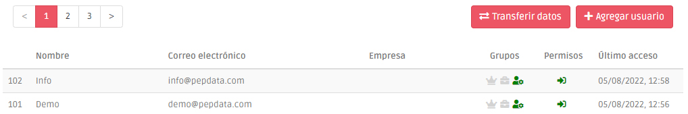

# Administración de Usuarios


Esta página sólo está disponible para los responsables de cada organización.


Esta página le permite ver todos los miembros de su organización, gestionar su acceso a la aplicación y agregar nuevos usuarios.

## Agregar Usuarios

Puede agregar manualmente un usuario a su organización utilizando el botón "+ Agregar usuario", que le da acceso a una ventana para hacerlo.

Tras la adición, el usuario recibirá un correo electrónico con todas las instrucciones para acceder a la plataforma.


Si el nuevo usuario no recibe el correo electrónico después de unos minutos, compruebe la casilla de SPAM.


## Gestión de permisos

Puede cambiar el acceso a la plataforma para cualquier usuario de su organización haciendo clic en el icono del permiso que desea desactivar o activar.

Si desactiva el permiso de inicio de sesión, el usuario afectado ya no podrá acceder a la plataforma.


### ¿Como puedo eliminar un usuario?

Los usuarios creados en la plataforma PEPData no pueden ser eliminados para preservar el [historial](historico.md) de sus acciones. Sin embargo, puede desactivar el acceso a un usuario de la plataforma desactivando su permiso de inicio de sesión. De este modo, su [historial](historico.md) permanecerá intacto pero el usuario en cuestión ya no tendrá acceso a los datos de su organización.&#x20;

