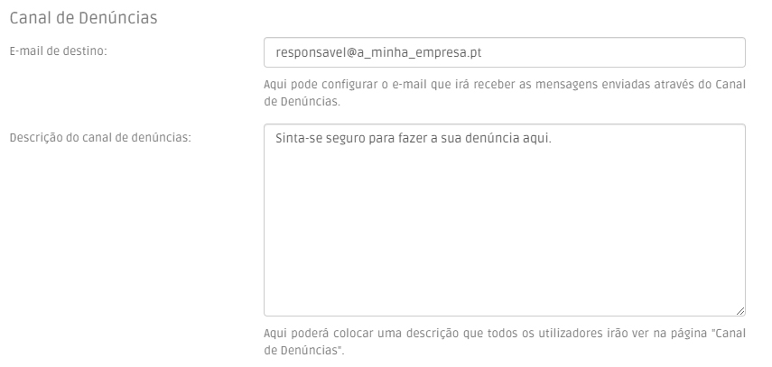

# Canal de Denúncias Interno

O **canal de denúncias interno com gestão interna** é um canal simples, que faz o envio automático das informações para o responsável da sua organização de forma anónima e segura.

### Como configurar o seu canal

Comece por inserir o email do responsável da sua organiazação no menu "Configurações". Pode ainda acrescentar um texto que aparecerá na página do canal de denúncias.

<figure><figcaption>
Menu Configurações
</figcaption></figure>

Depois deve registar todos os seus colaboradores como utilizadores na plataforma, para que possam ter acesso ao canal.

### Como proceder à denúncia

Para proceder à denúncia, basta ao utilizador dirigir-se ao menu “Canal de Denúncias“ e escrever a sua denúncia de forma detalhada e pormenorizada, podendo inclusivamente incluir anexos.

Se optar por divulgar a sua identidade, o denunciante pode ativar a caixa que diz “Enviar o meu nome e e-mail juntamente com a mensagem”. Se não o fizer, a sua denúncia será enviada de forma 100% anónima.

A plataforma enviará de seguida, de forma anónima e segura, a mensagem da denúncia e os seus anexos para o responsável escolhido pela sua organização.


As informações do remetente da denúncia nunca são gravadas e nunca poderão ser disponibilizadas.


<figure><figcaption>
Canal de Denúncias
</figcaption></figure>

**O que acontece após o envio da denúncia?**

Sendo um canal de denúncia com gestão interna, cabe à sua organização e ao responsável eligido tratar de todos os passos necessários para dar seguimento à denúncia, cumprindo os prazos definidos na [Lei n.º 93/2021](https://dre.pt/dre/detalhe/lei/93-2021-176147929?\_ts=1664361159196) que determina o regime geral de proteção de denunciantes e infrações.
