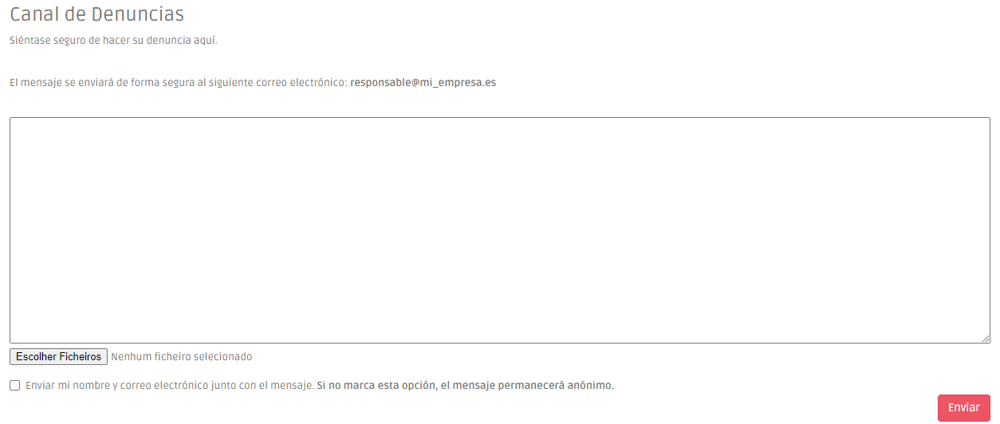

# Canal de Denuncias Interno de Gestión Externa

El **canal de denuncias interno con la gestión externa** es el mismo que el referido en el menú [Canal de Denuncias Interno](canal-de-denuncias-interno.md). Sin embargo, este canal envía automáticamente la información a un equipo especializado de abogados.

### Cómo configurar su canal

Comience insertando el correo electrónico de la persona responsable de contestar y gestionar la reclamación que, en este caso, y al tratarse de un canal gestionado externamente, será facilitado por PEPData. También puedes añadir un texto que aparecerá en la página del canal de denuncias.

<figure><figcaption></figcaption></figure>

A continuación, debe registrar a todos sus empleados como usuarios en la plataforma, para que puedan tener acceso al canal.

### Cómo presentar una denuncia

Para proceder a la denuncia, el usuario sólo tiene que ir al menú "Canal de denuncias" y redactar su denuncia de forma detallada, incluyendo los anexos.

Si decide revelar su identidad, el denunciante puede activar la casilla que dice "Enviar mi nombre y mi correo electrónico junto con el mensaje". Si no lo hacen, su informe se enviará de forma 100% anónima.

A continuación, la plataforma enviará, de forma anónima y segura, el mensaje de la denuncia y sus anexos al equipo de abogados encargado de tramitarlos.


Los datos del remitente de la denuncia nunca se registran y nunca podrán estar disponibles.


<figure><figcaption>
Canal de Denuncias
</figcaption></figure>

### ¿Qué ocurre después de enviar la denuncia?

&#x20;Al tratarse de un canal de denuncias gestionado externamente, el equipo de abogados asignado a su organización se encargará de dar todos los pasos necesarios para el seguimiento de la denuncia. Estos pasos y plazos son los definidos en la Lay de protección de denunciantes.
