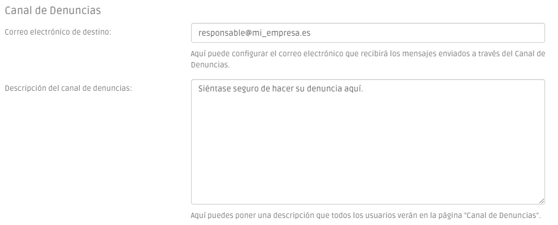
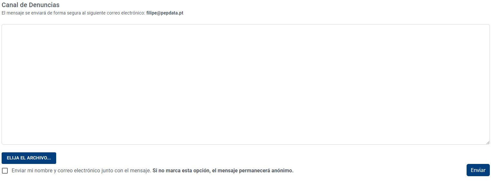

# Canal de Denuncias Interno

El **canal de denuncias con gestión interna** es un canal sencillo, que envía automáticamente la información al responsable de su organización de forma anónima y segura.

### Cómo configurar su canal

Comience por introducir la dirección de correo electrónico del responsable de su organización en el menú "Configuraciones". También puede añadir un texto que aparecerá en la página del canal del canal de denuncias.

<figure><figcaption></figcaption></figure>

A continuación, debe registrar a todos sus empleados como usuarios en la plataforma, para que puedan tener acceso al canal.

### Cómo presentar una denuncia

Para proceder a la denuncia, el usuario sólo tiene que ir al menú "Canal de denuncias" y redactar su denuncia de forma detallada, incluyendo los anexos.

Si decide revelar su identidad, el denunciante puede activar la casilla que dice "Enviar mi nombre y mi correo electrónico junto con el mensaje". Si no lo hacen, su informe se enviará de forma 100% anónima.

La plataforma enviará entonces, de forma anónima y segura, el mensaje de la denuncia y sus anexos a la persona responsable elegida por su organización.


Los datos del remitente de la denuncia nunca se registran y nunca podrán estar disponibles.


<figure><figcaption>
Canal de Denuncias
</figcaption></figure>

### ¿Qué ocurre después de enviar la denuncia?

Al tratarse de un canal de denuncia gestionado internamente, corresponde a su organización y a la persona designada realizar todas las gestiones necesarias para el seguimiento de la denuncia, en cumplimiento de los plazos establecidos en la Ley, que determina el régimen general de protección de los denunciantes.

