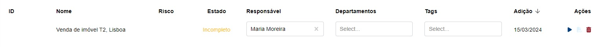

# Transações

Nesta página, devem ser registadas todos as transações que tenham sido efetuadas ou mediadas pela sua organização.


Embora existam transações de baixo valor que a lei não obriga a registar, a PEPData recomenda que registe tantas transações quanto consiga, uma vez que o sistema efetua o cálculo do valor acumulado por cada cliente, afetando este o seu risco.


O processo inicia-se ao criar um "Registo rápido", que lhe permite criar rapidamente uma transação no sistema. Para tal, apenas necessita de preencher o campo "Designação", que serve como identificador da transação a que se refere. Exemplo: "Venda de imóvel T2, Lisboa".

Após ter criado a transação, esta ficará disponível numa tabela, podendo o questionário que lhe respeita ser acedido através do botão "▶". Pode, ainda, utilizar o botão “🗑️" para apagar transações.

Após submissão do questionário da transação, irão ser criados automaticamente todos os "Registos rápidos" dos intervenientes na transação, com exceção da sua própria empresa. Estes registos rápidos poderão ser acedidos na página de [Registo de Clientes](/broken/pages/-MIxvjfeV-Nrg-dr_2uw).

Os questionários já submetidos poderão ser visualizados através do botão "👁".

Note que o registo de uma transação só se encontra verdadeiramente concluído após submissão do respetivo questionário e de todos os questionários dos seus intervenientes.

### FAQs

O que posso pôr no campo "designação"? O nome do cliente ou o descritivo da transação?

Neste menu, o campo "designação" é referente ao descritivo da transação.

Não tenho todos os dados, posso registar a transação mesmo assim?

Para registar a transação, todos os dados obrigatórios têm de estar preenchidos, incluindo não só o formulário referente à transação, mas também os formulários referentes aos seus intervenientes.

Contudo, pode ir inserindo os seus dados à medida que os obtenha e só submeter o registo quando este estiver completo.

No menu lateral, há a indicação de quais os dados em falta ou incompletos. Esta informação é disponibilizada até ao momento em que o preenchimento do registo esta completo.

Até que data passada posso inserir a transação?

Embora a lei indique que deve fazer esse registo antecipadamente, para obter a notação do risco e proceder aos deveres exigidos, é também importante que mantenha atualizado o histórico de transações.

Se por algum motivo, aquando da transação, não for possível fazer o seu registo, poderá fazê-lo posteriormente e em qualquer altura.

Qual é o limite de serviços que posso inserir?

Não há limite de serviços a inserir, contudo a lei não o obriga ao registo de transações de baixo valor.

No entanto, se registar todas as suas transações, estará a manter um registo mais fiável. A plataforma faz o cálculo automático dos valores, gerando diagnósticos de risco mais exatos.

Qual a diferença entre prestação de serviços pontuais, regulares e irregulares?

A prestação de serviços regular, é referente a um serviço constante no montante durante um determinado espaço de tempo, que não varia nem na sua proporção nem na sua obrigação.

A prestação de um serviço irregular, é referente a um serviço que varia de modo não uniforme ou desigual, tanto em quantidade, montesntes ou datas de execução.

A prestação de um serviço pontual, é referente a um serviço que não se prolonga no tempo, ou seja, a um serviço que é esporádico ou que acontece uma única vez.

Os pagamentos vão ser em prestações, mas não do mesmo valor. É necessário criar vários pagamentos?

Não há necessidade de criar vários pagamentos. Ao registar a transação, pode definir o tipo de frequência: pontual, regular ou irregular. A frequência de pagamento é definida pelo cliente, podendo desbloquear o formulário para anexar novos pagamentos.

O mais importante, acima de tudo, é que mantenha o registo atualizado e dinânimo.

Como é calculado o risco da transação?

O risco de transação é composto por três categorias distintas de risco: baixo, médio e alto. Cada transação é enquadrada nas várias categorias de risco, tendo em consideração os seguintes critérios:

* Existência de suspeição:
  * Caso suspeite da documentação apresentada ou da transação em si
* Montante:
  * Caso o montante seja superior a 15.000€
* Combinação entre Método de pagamento e Montante:
  * Caso o método de pagamento seja numerário e o montante seja superior a 3.000€

