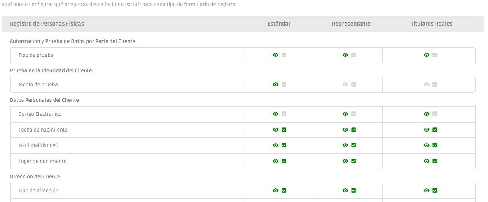

# Configuración del Formulario de Registro de Cliente

Como cada cliente tiene necesidades diferentes, hemos desarrollado la posibilidad de modelar nuestros formularios KYC de acuerdo con sus necesidades.

El formulario _know your customer_, a través de [Registro de Clientes](../registo-de-clientes/) y [Transacciones](../registo-de-transacoes/), puede configurare según sus premisas haciendo que los campos sean opcionales, o incluso eliminándolos. Esto permite configurarlo según sus necesidades, su actividad empresarial y el cumplimiento de la normativa de su sector.

<figure><figcaption></figcaption></figure>
