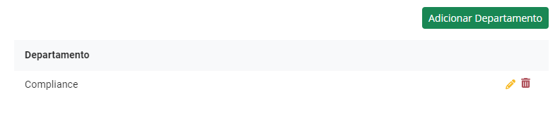
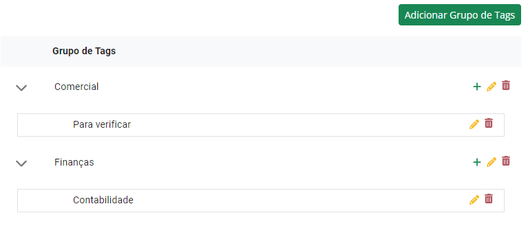

# Registos

## Autopreenchimento

Nesta secção pode configurar o preenchimento automático dos seus titulares de ação/direitos de voto, beneficiários efetivos e dados gerais dos seus registos.

Se tiver adquirido o autopreenchimento e este se encontrar ativo, o preenchimento acontece automaticamente ao criar o seu registo.

## Departamentos

Nesta secção pode criar, editar ou eliminar os departamentos da sua organização. Pode depois utilizar estes departamentos para os atribuir aos seus registos, facilitando a filtragem e a organização destes.

<figure><figcaption></figcaption></figure>

## Modelação

Porque cada cliente tem necessidades diferents, desenvolvemos a possibilidade de modelar os nossos formulários KYC conforme as suas necessidades.

O formulário _know your customer_, através dos [Registos de Clientes](../customer-registrations/) e de [Transações](../registo-de-transacoes/), pode ser customizado à sua medida, podendo tornar os campos opcionais, ou até removê-los. Isto permite que seja configurado de acordo com as suas necessidades, atividade comercial e cumprimento com o regulamento do seu setor.

<figure><figcaption></figcaption></figure>

## Tags

Nesta secção pode criar, editar e eliminar tags, organizadas por grupos, para poder classificar os seus registos. As tags podem depois ser atribuídas aos seus registos para facilitar a sua filtragem e organização.

<figure><figcaption></figcaption></figure>
