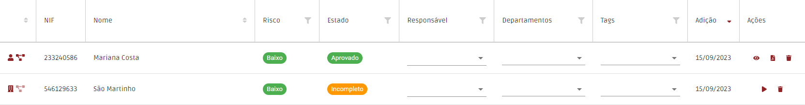

# Registos de clientes

Nesta página, devem ser registados todos os clientes da organização, bem como intervenientes nas transações que tenham ocorrido.

De momento, é possível fazer o registo das seguintes pessoas:

* Pessoas singulares
  * Cliente (pessoa singular)
  * Representantes de pessoas singulares ou coletivas
  * Beneficiários efetivos
* Pessoas coletivas
  * Cliente (pessoa coletiva)
  * Pessoas coletivas titulares de participações no capital de outras pessoas coletivas

O processo de registo inicia-se ao criar um "Registo rápido", que lhe permite criar rapidamente uma pessoa no sistema. Para tal, apenas necessita de preencher o tipo de pessoa, o seu nome e NIF/NIPC.

Após ter criado a pessoa, esta ficará disponível numa tabela, podendo o questionário que lhe respeita ser acedido através do botão "▶".

Nos casos de pessoas coletivas, após submissão do questionário irão ser criados automaticamente todos os "Registos rápidos" dos seus beneficiários efetivos e/ou representantes, caso tenham sido identificados.

Os questionários já submetidos poderão ser visualizados através do botão "👁".

Note que o registo de uma pessoa coletiva só se encontra verdadeiramente concluído após submissão do respetivo questionário e de todos os questionários dos seus beneficiários efetivos.

## Tipos de Registos Individuais

Existem quatro tipo de registos de pessoas individuais:

* Standard
* Representante
* Beneficiário Efetivo
* Titular/Gerente

Os diferentes tipos de registos funcionam da mesma forma, sendo os campos obrigatórios aqueles que são exigidos por lei. Contudo, visto que não há uma obrigatoriedade legal de preencher todos os dados de um titular/gerente, este tipo não inclui os mesmos campos, nem as mesmas obrigações que os restantes.

Se pretender configurar os campos disponíveis ou a sua obrigatoriedade, consulte a [página de modelação do formulário](../configuracoes/modelacao-do-formulario-de-registo-de-cliente.md#modelacao).

## Apagar registos

Pode utilizar o botão “🗑️" para apagar registos.

No entanto, é importante referir que um registo apenas pode ser apagado caso não esteja referenciado por outros registos. Caso tente apagar um registo que está referenciado, a aplicação irá mostrar-lhe todos os registos que o referenciam e que necessitam de ser apagados/alterados previamente.


**O beneficiário efetivo/representante de uma empresa mudou, como posso apagar o registo da pessoa anterior?**

Neste caso, deve alterar o questionário da empresa, atualizando os seus beneficiários efetivos/representantes. Após alteração, já deverá poder apagar o registo do anterior beneficiário efetivo/representante, assumindo que este não está referenciado noutras empresas por si registadas.


### FAQs

Tenho um cliente com o NIF estrangeiro. Como posso contornar esta situação?

Para considerar o registo válido, antes do NIF insira as letras correspondentes ao domínio do país. Por exemplo, se o NIF for referente a França deve inserir: "FR555555555"

No final do registo reparei que me enganei no nome. Posso editar?

Não, não é possível editar o nome de um cliente já criado. Caso se tenha enganado, terá que remover o registo e registar novamente o cliente com os dados corretos.

Que pessoas devo introduzir na secção Estrutura de Propriedade e Controlo?

Segundo a Lei 83/2017, Artigo 24.º 1.b, deve ser aferida a: "v) Identidade dos titulares de participações no capital e nos direitos de voto de valor igual ou superior a 5 %;"

Note que, caso identifique titulares de participações no capital e nos direitos de voto inferior a 5 %, a aplicação irá obrigá-lo a recolher os elementos identificativos referidos na lei.

Quero inserir uma pessoa relacionada com uma transação, devo começar por a registar?

A escolha de registar em primeiro lugar ou não o cliente individual, fica sempre a cargo do cliente.

Caso pretenda começar por registar a transação, pode nesse mesmo registo associar como comprador, vendedor ou representante uma pessoa existente ou criar uma nova. Nesta último caso, o registo é criado automaticamente, tendo apenas que completar os dados em falta.

Quero registar um beneficiário efetivo. Devo registar primeiro a organização?

A escolha de registar em primeiro lugar ou não a organização ou o cliente individual, fica sempre a cargo do cliente.

Caso pretenda começar por registar a organização, pode nesse mesmo registo associar como representante, titular ou beneficiário efetivo uma pessoa existente ou criar uma nova. Nesta último caso, o registo é criado automaticamente, tendo apenas que completar os dados em falta.

Como posso ter a certeza que esta pessoa é PEP?

Para ter a certeza que a pessoa é PEP, basta fazer a verificação no registo de clientes. Este sugerirá nomes com um determinado grau de semelhança tal como no menu de validações.

Não tenho forma de comprovar a identidade do cliente. Posso submeter o formulário?

Não. Para submeter o formulário, terá de introduzir obrigatoriamente o nome e fazer upload de um documento de identificação válido (CC, BI, Passaporte, Autorização de Residência, Boletim ou Certidão de Nascimento), ou fazer uma autenticação eletrónica.

Como posso saber se a pessoa é potencialmente suspeita?

A análise de suspeita é feita pelo cliente, ou conforme definido na lista de suspeições.

De momento não tenho comprovação dos dados do cliente. Posso inserir mais tarde?

Sim, desde que não submeta o registo. Para o registo ficar completo precisa obrigatoriamente de inserir a comprovação dos dados.

Em alternativa pode configurar o seu registo para não requerer o comprovativo. Para isso veja o nosso separador de "Modelação do Formulário de Registo de Cliente".

Qualquer pessoa pode inserir/eliminar registos?

Não. É o responsável pela organização que faz a gestão dos utilizadores da plataforma (independentemente da categoria).

Desta forma, só as pessoas autorizadas pela organização podem aceder e utilizar o registo de clientes. Todas as ações efetuadas ficam registadas no histórico.

Na área "É Pessoa Identificável" surgiram-me vários nomes iguais. Como sei qual procuro?

Os resultados são sugeridos pela semelhança do nome. Todos os nomes que formam o nome inserido no registo têm de constar também no nome da pessoa identificável.

São-lhe dados até 25 nomes com diferentes graus de semelhanças sugeridos pela plataforma. A partir daí é importante verificar qual o que procura.

Na área "É Pessoa Identificável" quero ver os dados dos resultados apresentados. Posso fazê-lo?

Sim, se adquirir o menu de validações. No caso de ter acesso a este menu e o seu registo lhe apresentar resultados compatíveis com o nome introduzido, aparecer-lhe-á uma lista de nomes acompanhados de um botão de um olho. Pode clicar no botão do olho e consultar todos os dados referentes a essa pessoa e comprovar que se trata da pessoa correta.

Como é definida a aprovação?

A aprovação é sempre definida por si.

Infrinjo a lei se alterar os campos visíveis no formulário de registo de clientes?

A PEPData permite que cada cliente customize os seus formulários de acordo com a informação que tem, evitando desta forma que os formulários na plataforma fiquem incompletos e sem risco atraibuído.

Há medida que for angariando mais informações sobre os seus clientes, pode acrescentar os campos de novas informações como obrigatórios aos seus formulários.

Para saber mais sobre esta customização veja "Modelação do Formulário de Registo de Cliente".

Criei um titular/gerente no meu registo e agora queria adioná-lo como beneficiário efetivo, como posso fazer?

O tipo de registo titular/gerente é um registo mais simplificado e com menos campos por não haver obrigação legal para o seu preenchimento detalhado. Contudo, no caso de um beneficiário efetivo, essa obrigação existe. Desta forma, deverá eliminar o seu registo criado como sendo titular/gerente, e criá-lo primeiramente como um registo standard, de representante ou de beneficiário efetivo. Depois, poderá adicionar novamente o seu registo como sendo titular/representante de uma entidade.

