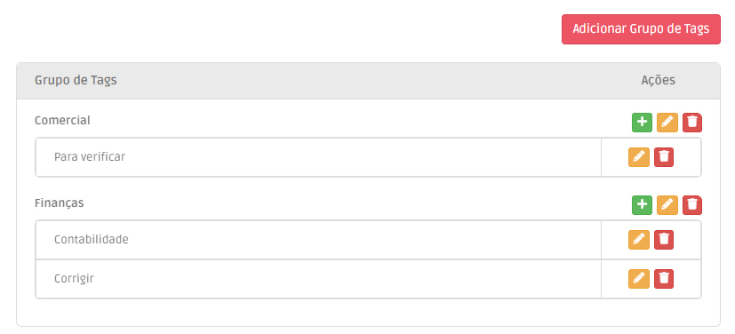

# Tags

A ferramenta de Tags permite-lhe criar tags personalizadas, organizadas por diferentes grupos, que podem ser adicionadas aos seus registos de clientes, organizações ou de transações.

<figure><figcaption>
Crie as suas tags personalizadas.
</figcaption></figure>
