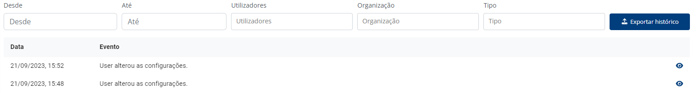

# Histórico

Esta página permite-lhe visualizar todos os eventos relevantes que ocorreram dentro da sua organização.

Na listagem de eventos irá aparecer a data e descrição de cada evento, podendo ver os detalhes de cada evento através do botão “👁”.

## Tipo de eventos registados

### Validações

* Adição, remoção, cancelamento e submissão.

### Utilizador

* Inicio de sessão, adição de novo utilizador e pesquisa efetuada.

### Pessoa Identificável

* Adição e visita de perfil.


Os detalhes de cada evento poderão fornecer informação bastante relevante para fins de auditoria. Ao realizar uma pesquisa, por exemplo, são guardados os resultados que lhe foram apresentados no momento em que pesquisou.


## Outras funcionalidades

### Exportação do Histórico

Através do botão “Exportar PDF”, pode exportar para um PDF todo o histórico visível que lhe é visível.

### Pesquisa do Histórico

Através da barra de pesquisa, pode escrever qualquer expressão que pretenda utilizar para filtrar os eventos mostrados. Pode filtrar por descrição do evento ou por data.
