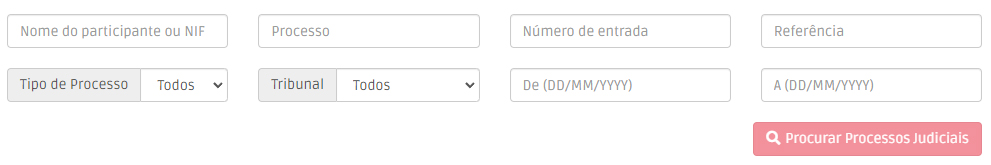

# Processos Judiciais

Este menu permite-lhe pesquisar qualquer processo judicial dos Tribunais de Primeira Instância e Tribunais Administrativos e Fiscais. Para faciliar a sua pesquisa, pode selecionar vários filtros e pesquisar por nome, NIF/NIPC, datas, processo, número de entrada, etc.

Se tiver acesso ao menu de [Validação Detalhada de PEPs e Sancionados](../validacoes/), pode ver quaisquer processos judiciais associados a uma pessoa identificável, sempre que consulta os seus detalhes.

<figure><figcaption>
Menu Processos Judicias
</figcaption></figure>

Esta nova pesquisa permite-lhe fazer uma análise mais precisa do risco de cada pessoa e encontrar rapidamente a informação que procura. Todos os resultados de pesquisa são instantâneos.
