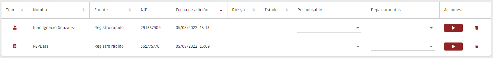

# Registro de Clientes

En esta página deben registrarse todos los clientes de la organización, así como los implicados en las transacciones realizadas.

Por el momento, es posible registrar a las siguientes personas:

* Personas físicas&#x20;
  * Cliente (persona física)
  * Representantes de personas físicas o jurídicas
  * Beneficiarios efectivos
* Personas jurídicas
  * Cliente (persona jurídica)
  * Personas jurídicas que participan en el capital de otras personas jurídicas

El proceso de registro comienza con la creación de un "registro rápido", que permite crear rápidamente una persona en el sistema. Para ello, sólo tiene que rellenar el tipo de persona, su nombre y su número de NIF/CIF.

Después de haber creado la persona, ésta estará disponible en una tabla, y se podrá acceder al cuestionario que le concierne a través del botón "▶".

En el caso de las personas jurídicas, tras la presentación del cuestionario, se crearán automáticamente todos los "Registros Rápidos" de sus beneficiarios efectivos y/o representantes si han sido identificados.

Los cuestionarios ya presentados pueden verse a través del botón "👁".&#x20;

Tenga en cuenta que el registro de una entidad jurídica sólo está realmente completo después de la presentación de su cuestionario y de los cuestionarios de todos sus beneficiarios efectivos.

## Eliminar registros

Puede utilizar el botón “🗑️" para eliminar registros.&#x20;

Sin embargo, es importante tener en cuenta que un registro sólo puede ser eliminado si no está referenciado por otros registros. Si intenta eliminar un registro referenciado, la aplicación le mostrará todos los registros que lo referencian y que deben ser eliminados/modificados previamente.


**El beneficiario/representante de una empresa ha cambiado, ¿cómo puedo eliminar el registro de la persona anterior?**

En este caso, debe cambiar el cuestionario de la empresa, actualizando sus beneficiarios/representantes. Tras el cambio, debería poder eliminar el registro del anterior beneficiario/representante, asumiendo que no esté referenciado en otras empresas registradas por usted.


### FAQs

Tengo un cliente con un NIF extranjero. ¿Cómo puedo solucionar esta situación?

Para considerar válido el registro, antes del NIF, introduzca las letras correspondientes al dominio del país. Por ejemplo, si el número de identificación fiscal se refiere a Francia, debe introducir: "FR555555555"

Al finalizar el registro me di cuenta de que me había equivocado en el nombre. ¿Puedo editarlo?

No, no puede editar el nombre de un cliente que ya ha creado. Si se ha equivocado, tendrá que eliminar el registro y volver a registrar al cliente con los datos correctos.

¿Qué personas debo introducir en la sección de Estructura de Propiedad y Control?

Según la Ley Ley 10/2010 de 28 de abril de prevención del blanqueo de capitales y de la financiación del terrorismo “la persona o personas físicas que en último término posean o controlen, directa o indirectamente, un porcentaje superior al 25 por ciento del capital o de los derechos de voto de una persona jurídica, o que por otros medios ejerzan el control, directo o indirecto, de una persona jurídica.”&#x20;

Tenga en cuenta que, si identifica a titulares de participaciones en el capital y de derechos de voto inferiores al 25%, la solicitud le obligará a recoger los elementos de identificación a los que se refiere la ley.&#x20;

Quiero introducir a una persona relacionada con una transacción, ¿debo registrarla primero?

Siempre es el cliente el que elige si se registra primero o no.&#x20;

Si quiere empezar registrando la transacción, puede asociar a una persona existente como comprador, vendedor o representante o crear una nueva. En este último caso, el registro se crea automáticamente y sólo tiene que completar los datos que faltan.&#x20;

Quiero registrar un titular real. ¿Debo registrar primero la organización?

La decisión de registrar o no primero a la organización o al cliente individual siempre depende del cliente.&#x20;

Si desea registrar primero la organización, puede, en el mismo registro, asociar a una persona existente como representante, titular o titular real, o crear una nueva. En este último caso, el registro se crea automáticamente, requiriendo únicamente completar los datos que faltan.&#x20;

¿Cómo puedo estar seguro de que esta persona es un PRP?

Para asegurarse de que la persona es un PRP, basta con comprobar el registro del cliente. Sugerirá nombres con cierto grado de similitud como en el menú de validación.

No tengo forma de verificar la identidad del cliente. ¿Puedo enviar el formulario?

No. Para enviar el formulario, debe introducir el nombre y subir un documento de identificación válido (DNI, NIF, NIE, Pasaporte, Permiso de Residencia, Certificado de Nacimiento), o realizar una autenticación electrónica.

¿Cómo puedo saber si una persona es un potencialmente sospechosa?

El análisis de la sospecha lo realiza el cliente, o según lo definido en la lista de sospechas.

Por el momento no tengo comprobación de los datos del cliente. ¿Puedo introducirlo más tarde?

Sí, siempre que no envíe el registro. Para que el registro esté completo debe introducir la comprobación de los datos.&#x20;

También puede configurar su registro para que no requiera la comprobación de datos. Para ello, consulte nuestra pestaña "Configuración del formulario de Registro de clientes".&#x20;

¿Puede alguien añadir/borrar registros?

No. Es el responsable de la organización quien gestiona los usuarios de la plataforma (independientemente de la categoría).&#x20;

Por lo tanto, sólo las personas autorizadas por la organización pueden acceder y utilizar el registro de clientes. Todas las acciones realizadas se registran en el historial.&#x20;

En el área "Es una persona identificable" aparecieron varios nombres iguales. ¿Cómo puedo saber cuál buscar?

Los resultados se sugieren por la similitud del nombre. Todos los nombres que componen el nombre inscrito en el registro deben estar también en nombre de la persona identificable.&#x20;

La plataforma le propone hasta 25 nombres con diferentes grados de similitud. A partir de ahí es importante comprobar cuál es el que se busca.&#x20;

En el área "Es una persona identificable", quiero ver los datos de los resultados mostrados. ¿Puedo hacerlo?

Sí, si adquiere el menú de validación. Si tiene acceso a este menú y su registro le muestra resultados compatibles con el nombre que ha introducido, verá una lista de nombres acompañada de un icono del ojo. Puede pulsar el botón del ojo y consultar todos los datos relativos a esa persona y comprobar que se trata de la persona correcta.

¿Cómo se define la aprobación?

La aprobación siempre la define usted.

¿Infringiré la ley si cambio los campos visibles del formulario de registro de clientes?

PEPData permite a cada cliente personalizar sus formularios en función de la información de que disponga, evitando así que los formularios de la plataforma queden incompletos y sin riesgo atribuido. &#x20;

A medida que vaya recopilando más información sobre sus clientes, podrá añadir los nuevos campos de información como obligatorios a sus formularios.&#x20;

Para saber más sobre esta personalización, consulte "Configuración de formularios de registro de clientes".&#x20;

