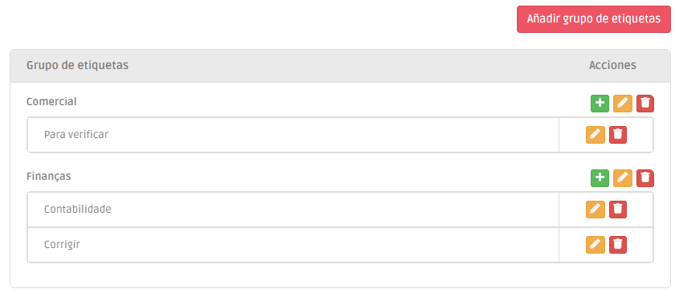

# Etiquetas

La herramienta Etiquetas le permite crear clasificaciones personalizadas, organizadas por diferentes grupos, que pueden añadirse a sus registros de clientes, organizaciones o transacciones.

<figure><figcaption></figcaption></figure>
