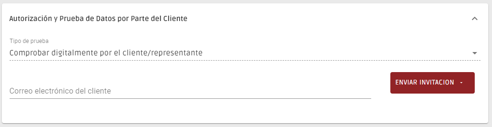

# Invitación para Completar el Registro

Para obtener los datos de sus clientes sin dañar la relación que tiene con ellos, hemos desarrollado la invitación a completar. Se trata de una sencilla herramienta dentro del menú de registro de clientes que le permite enviar una invitación a su cliente para que rellene sus propios datos en el formulario.

Comience creando el cliente o introduciendo un cliente existente, y en el tipo de prueba seleccione "Para ser probado digitalmente por el cliente o representante". A continuación, basta con rellenar la dirección de correo electrónico del cliente y hacer clic en "enviar invitación" y elegir el idioma en el que debe enviarse.

<figure><figcaption></figcaption></figure>

Su cliente recibirá un correo electrónico en nombre de su empresa invitándole a cumplimentar todos sus datos. Al comienzo, su cliente debe autorizar primero el tratamiento de los datos, asegurándose de que el contenido cumple con las normas exigidas por la ley.

Cuando su cliente complete el registro y lo confirme, recibirá automáticamente un correo electrónico para informarle.

Cuando acceda de nuevo a la ficha del cliente, tendrá acceso a todos los datos facilitados y podrá confirmarlos, concluyendo el registro pulsando "enviar".
