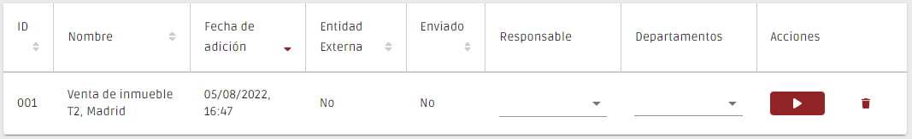

# Registro de Transacciones

En esta página deben registrarse todas las transacciones realizadas o mediadas por su organización.


Aunque hay operaciones de bajo valor que la ley no obliga a registrar, PEPData recomienda registrar todas las operaciones que se puedan, ya que el sistema calcula el valor acumulado de cada cliente, afectando a su riesgo.


El proceso comienza con la creación de un "registro rápido", que le permite crear rápidamente una transacción en el sistema. Para ello, sólo tiene que rellenar el campo "Título", que sirve como identificador de la transacción a la que se refiere. Ejemplo: "Venta de immueble, Madrid".

Una vez creada la transacción, estará disponible en una tabla y se podrá acceder al cuestionario relacionado a través del botón "▶". También puede utilizar el botón “🗑️"para eliminar transacciones.

Después de enviar el cuestionario de la transacción, se crearán automáticamente todos los "Registros rápidos" de los partícipes en la transacción, a excepción de su propia empresa. Se puede acceder a estos registros rápidos en el [Registro de Clientes](../registo-de-clientes/).&#x20;

Los cuestionarios ya presentados pueden verse a través del botón "👁".&#x20;

Tenga en cuenta que el registro de una transacción sólo está realmente completo tras la presentación del respectivo cuestionario y de todos los cuestionarios de sus partícipes.

### FAQs

¿Qué puedo poner en el campo "designación"? ¿El nombre del cliente o la descripción de la transacción?

En este menú, el campo "designación" se refiere a la descripción de la transacción.

No tengo todos los datos, ¿puedo registrar la transacción?

Para registrar la transacción, hay que rellenar todos los datos requeridos, incluyendo no sólo el formulario de la transacción, sino también los formularios referidos a las partes implicadas.&#x20;

Sin embargo, puede introducir los datos a medida que los obtenga y sólo enviar el registro cuando esté completo.&#x20;

En el menú lateral se indica qué datos faltan o están incompletos. Esta información está disponible hasta que se complete el registro.&#x20;

¿Hasta qué fecha pasada puedo introducir la transacción?

Aunque la ley indica que debe inscribirse previamente para obtener la calificación de riesgo y realizar las tareas requeridas, también es importante que mantenga su historial de transacciones al día. &#x20;

Si por alguna razón, en el momento de la transacción, no es posible hacer su registro, puede hacerlo más tarde y en cualquier momento.&#x20;

¿Cuál es el límite del número de servicios que puedo introducir?

No hay límite en el número de servicios que puede introducir, sin embargo la ley no le obliga a registrar transacciones de bajo valor.&#x20;

Sin embargo, si registra todas sus transacciones, llevará un registro más fiable. La plataforma calcula automáticamente los valores, generando diagnósticos de riesgo más precisos.&#x20;

¿Cuál es la diferencia entre prestación de servicios ocasional, regular e irregular?

Prestación de servicio regular, se refiere a un servicio que es constante en cantidad durante un determinado periodo de tiempo, que no varía ni en su proporción ni en su obligación.&#x20;

La prestación irregular de un servicio se refiere a un servicio que varía de manera no uniforme o desigual, ya sea en cantidad, cantidades o fechas de ejecución.&#x20;

La prestación de un servicio puntual se refiere a un servicio que no se prolonga en el tiempo, es decir, un servicio que es esporádico o que ocurre una sola vez.&#x20;

¿Cómo se calcula el riesgo de una transacción?

El riesgo de una transacción tiene tres categorías distintas: bajo, medio y alto. Cada operación se enmarca en las distintas categorías de riesgo, teniendo en cuenta los siguientes criterios:&#x20;

* Existencia de sospechas:
  * Si sospecha que la documentación presentada o de la transacción en si&#x20;
* Cantidad:
  * En caso de que el importe sea superior a 15.000&#x20;
* Combinación entre método de pago e importe:&#x20;
  * Si el método de pago es en efectivo y el importe es superior a 3.000 euros&#x20;

