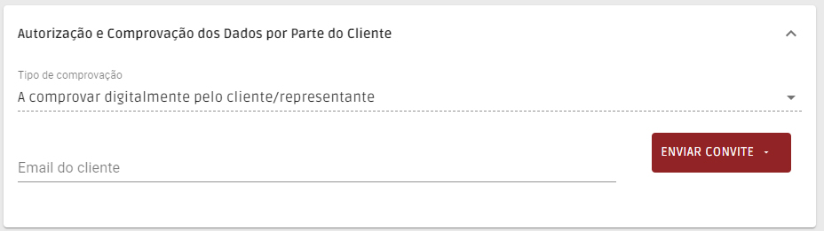

# Convite de Preenchimento de Registo

De forma a obter os dados por parte dos seus clientes sem prejudicar a relação que tem com eles, desenvolvemos o convite ao preenchimento. Esta é uma ferramenta simples dentro do menu de registo de clientes, que permite enviar um convite para o seu cliente, para que seja ele a preencher os seus próprios dados no formulário.

Comece por criar o cliente ou entrar num cliente já existente, e no tipo de comprovação selecione “A comprovar digitalmente pelo cliente ou representante”. Depois basta preencher o email do cliente e clicar em “enviar convite” e escolher a língua em que deve ser enviado.

<figure><figcaption></figcaption></figure>

O seu cliente receberá um email em nome da sua empresa com o convite para preencher todos os seus dados. Ao iniciar o preenchimento, o seu cliente tem que primeiro autorizar o tratamento dos dados, garantindo-lhe que o preenchimento cumpre as normas exigidas por lei.

Quando o seu cliente completar o registo e confirmar, receberá automaticamente um email a informá-lo.

Ao voltar a aceder à ficha do cliente, já terá acesso a todos os dados disponibilizados e poderá confirmá-los, dando por concluído o registo, clicando em “submeter”.
