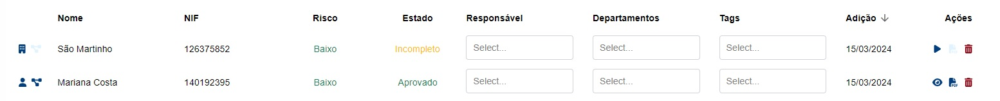

# Fornecedores

Nesta página, devem ser registados todos os clientes da organização, bem como intervenientes nas transações que tenham ocorrido.

De momento, é possível fazer o registo das seguintes pessoas:

* Pessoas singulares
  * Cliente (pessoa singular)
  * Representantes de pessoas singulares ou coletivas
  * Beneficiários efetivos
* Pessoas coletivas
  * Cliente (pessoa coletiva)
  * Pessoas coletivas titulares de participações no capital de outras pessoas coletivas

O processo de registo inicia-se ao criar um "Registo rápido", que lhe permite criar rapidamente uma pessoa no sistema. Para tal, apenas necessita de preencher o tipo de pessoa, o seu nome e NIF/NIPC.

Após ter criado a pessoa, esta ficará disponível numa tabela, podendo o questionário que lhe respeita ser acedido através do botão "▶".

Nos casos de pessoas coletivas, após submissão do questionário irão ser criados automaticamente todos os "Registos rápidos" dos seus beneficiários efetivos e/ou representantes, caso tenham sido identificados.

Os questionários já submetidos poderão ser visualizados através do botão "👁".

Note que o registo de uma pessoa coletiva só se encontra verdadeiramente concluído após submissão do respetivo questionário e de todos os questionários dos seus beneficiários efetivos.

## Tipos de Registos Individuais

Existem quatro tipo de registos de pessoas individuais:

* Standard
* Representante
* Beneficiário Efetivo
* Titular/Gerente

Os diferentes tipos de registos funcionam da mesma forma, sendo os campos obrigatórios aqueles que são exigidos por lei. Contudo, visto que não há uma obrigatoriedade legal de preencher todos os dados de um titular/gerente, este tipo não inclui os mesmos campos, nem as mesmas obrigações que os restantes.

Se pretender configurar os campos disponíveis ou a sua obrigatoriedade, consulte a [página de modelação do formulário](../configuracoes/modelacao-do-formulario-de-registo-de-cliente.md#modelacao).

## Apagar registos

Pode utilizar o botão “🗑️" para apagar registos.

No entanto, é importante referir que um registo apenas pode ser apagado caso não esteja referenciado por outros registos. Caso tente apagar um registo que está referenciado, a aplicação irá mostrar-lhe todos os registos que o referenciam e que necessitam de ser apagados/alterados previamente.


**O beneficiário efetivo/representante de uma empresa mudou, como posso apagar o registo da pessoa anterior?**

Neste caso, deve alterar o questionário da empresa, atualizando os seus beneficiários efetivos/representantes. Após alteração, já deverá poder apagar o registo do anterior beneficiário efetivo/representante, assumindo que este não está referenciado noutras empresas por si registadas.


### FAQs
