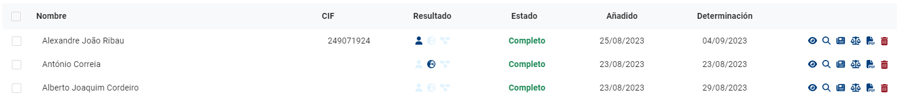
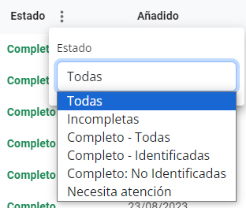

# Validaciones

Esta página le ayuda a determinar si sus clientes, clientes potenciales o beneficiarios son [personas indentificables](../../glossario/glossario-aplicacao.md#persona-identificable), también sirve como depósito de toda la información relacionada con ellos. PEPData denomina [validación ](../../glossario/glossario-aplicacao.md#validacion)a cada nombre agregado por usted.

## Estados de agregar, determinar y validaciones

Las [validaciones](../../glossario/glossario-aplicacao.md#validacion) se pueden agregar [manualmente](adicao-manual.md), una por una, o [automáticamente](upload-de-validacoes.md), lo que le permite agregar cientos de miles de [validaciones](../../glossario/glossario-aplicacao.md#validacion) a la vez.

Una vez agregada, una [validación](../../glossario/glossario-aplicacao.md#validacion) tendrá su estado como _Incompleta_, lo que significa que aún no se ha determinado si corresponde a una [persona identificable](../../glossario/glossario-aplicacao.md#persona-identificable). Esta determinación, al igual que la adición, también puede hacerse [manualmente](analise-manual.md), una por una, o [automáticamente](aplicacao-de-regras.md), lo que permite determinar cientos de miles de[ validaciones](../../glossario/glossario-aplicacao.md#validacion) a la vez. Después de esta operación, el estado de [validación](../../glossario/glossario-aplicacao.md#validacion) cambiará a _Completo_.&#x20;

Una validación _Completa_ podrá ser:&#x20;

* Completa - Identificado: si ha habido correspondencia con una persona identificable de la base de datos de PEPData o su país está sancionado.
* Completa - No identificado: si no ha habido correspondencia con una persona identificable de la base de datos de PEPData y su país no está sancionado.

## Validaciones que necesitan atención

La base de datos de PEPData de[ personas identificables ](../../glossario/glossario-aplicacao.md#persona-identificable)se actualiza constantemente, por lo que cada día se agregan nuevas personas. También pueden ser retirados de la plataforma si ya no hay razón para seguir identificados, por ejemplo, si han pasado 24 meses desde que ocuparon un puesto relevante por última vez y no tienen otra [classificación.](../../glossario/glossario-aplicacao.md#classificacion)

En este sentido, cada vez que haya actualizaciones que requieran su atención, por ejemplo: una validación que usted identificó como PRP ya no es PRP, las validaciones afectadas se marcarán como "requieren atención".


Esta señal no modifica en absoluto la decisión tomada anteriormente sobre la validación. \
Ejemplo: si una validación es _Completa_ - _no identificada_ y se ha agregado una[ persona identificable](../../glossario/glossario-aplicacao.md#persona-identificable) con el mismo nombre, la validación se marcará pero permanecerá como _Completa_ - _no identificada_.\
La aplicación, en este punto, sólo busca ayudar al usuario, dejando la decisión de determinar la validación de manera diferente al usuario.


Modificación y eliminación de validaciones

Si desea cambiar una[ validación](../../glossario/glossario-aplicacao.md#validacion) que ya está completa, puede pulsar el botón "✗", volverá a la _Incompleto._

Si desea eliminar una [validación](../../glossario/glossario-aplicacao.md#validacion), siempre puede presionar el botón “🗑️".Tenga en cuenta que sólo puede eliminar las validaciones con estado _Incompleto_. Si desea eliminar una validación completa, debe cancelarla primero (véase el paso anterior).

## Filtros

En esta página, también hay filtros que permiten mostrar las [validaciones](../../glossario/glossario-aplicacao.md#validacion) en cuanto a su estado u origen. Por defecto, todas las validaciones incompletas se muestran al abrir la página.

Si usa los filtros para incluir [validaciones ](../../glossario/glossario-aplicacao.md#validacion)_Completas_, aún puede ver su resultado a través de íconos:

* Persona azul: significa que se encontró una[ persona identificable](../../glossario/glossario-aplicacao.md#persona-identificable) de la base de datos da PEPData. Puede pulsar este icono para abrir su perfil.
* Persona translúcido: significa que no se ha encontrado ninguna coincidencia.
* Edificio azul: significa que se encontró una coincidencia con una organización sancionada. Puede hacer clic en este icono para abrir su perfil.&#x20;
* Edificio translúcido: significa que no se encontró ninguna coincidencia con esta organización.
* Globo azul: significa que el país introducido en la validación está sancionado.
* Globo translúcido: significa que el país introducido en la validación no está sancionado.

### FAQs

¿Todos los clientes tienen acceso a la función de validaciones?

No. Esta funcionalidad es de pago, por lo que es exclusiva para quienes la hayan adquirido.

El estado de mi cliente ha cambiado. ¿Puedo validarlo de nuevo?

Sí. Cuando reciba una notificación de que el estado de un cliente ha cambiado, puede volver al menú de validaciones y ver los detalles de esa persona.

¿Sólo es posible buscar por nombre?

La búsqueda puede realizarse con dos nombres y/o fecha de nacimiento y país. Estos datos se utilizan para cumplir plenamente con la ley RGPD.

No he obtenido ningún resultado en mi búsqueda, ¿por qué?

Si no obtiene ningún resultado, significa que en las listas de plataforma no hay ningún nombre con algún grado de similitud con el nombre introducido. En este caso, se le puede considerar una persona "no identificable".

Si está seguro de que esta persona es identificable, puede consultar: «[¿Para qué sirve el botón "añadir persona"?](./#undefined)»

¿Para qué sirve el botón "añadir persona"?

El botón "añadir persona" se utiliza para poner a una persona bajo vigilancia si usted la reconoce como PRP, miembro de la familia o asociado de PRP, pero que aún no figura en la plataforma. De este modo, puede añadir directamente una persona a su base de datos y validarla automáticamente.

¿Por qué alguien no está todavía en la lista PRP?

Cuando el nombre que busca aún no está disponible en las listas de PEPData, es porque la fuente oficial aún no está disponible. Todas las fuentes utilizadas por PEPData son oficiales y se comprueban regularmente, actualizando nuestras listas de forma permanente.

Sólo conozco apellidos abreviados (por ejemplo, P., T. M.), ¿obtengo resultados?

Sí, puede obtener resultados con abreviaturas. Sin embargo, también es importante definir bien las reglas de validación para no obtener resultados engañosos. Para que los resultados sean más fiables, el nombre debe estar completo o tener al menos dos nombres completos y la fecha de nacimiento. &#x20;

Cuanto más completos sean los datos introducidos, menos falsos positivos obtendrá.&#x20;

