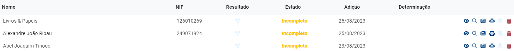
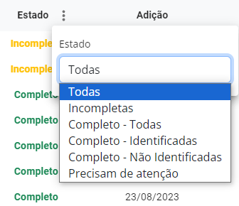
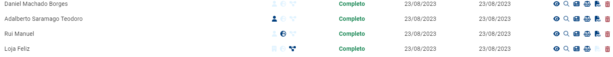
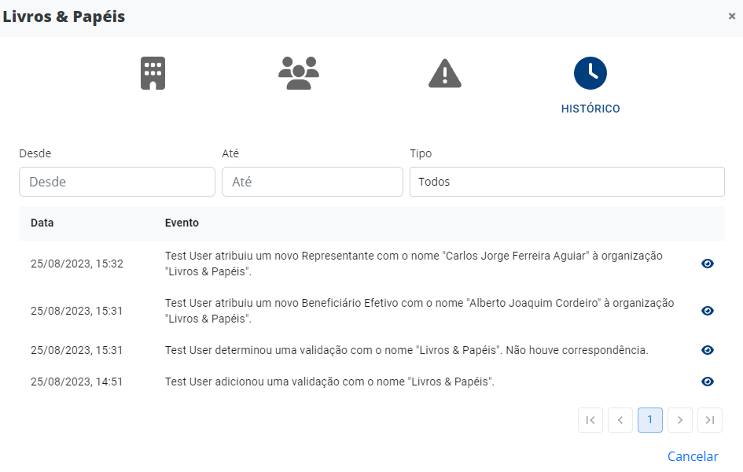

# Validações

Esta página ajuda-o a determinar se os seus clientes, potenciais clientes ou beneficiários são [pessoas identificáveis](../../glossario/glossario-aplicacao.md#pessoa-identificavel), servindo também como repositório de toda a informação relacionada com os mesmos. A PEPData denomina cada nome adicionado por si como sendo uma [validação](../../glossario/glossario-aplicacao.md#validacao).

## Adição, determinação e estados de validações

As [validações](../../glossario/glossario-aplicacao.md#validacao) podem ser adicionadas [manualmente](adicao-manual.md), uma a uma, ou [automaticamente](importacao-de-validacoes.md), o que lhe possibilita adicionar centenas de milhares de [validações](../../glossario/glossario-aplicacao.md#validacao) de uma só vez.

Um vez adicionada, uma [validação](../../glossario/glossario-aplicacao.md#validacao) irá ter o seu estado como _Incompleto_, o que significa que ainda não foi determinado se esta corresponde a uma [pessoa identificável](../../glossario/glossario-aplicacao.md#pessoa-identificavel) ou a uma [empresa sancionada](../../glossario/glossario-aplicacao.md#sancionado) (caso seja uma validação referente a uma organização). Esta determinação, à semelhança da adição, pode também ser feita [manualmente](analise-manual.md), uma a uma, ou [automaticamente](aplicacao-de-regras.md), o que lhe possibilita a determinação de centenas de milhares de [validações](../../glossario/glossario-aplicacao.md#validacao) de uma só vez. Após esta operação, o estado da [validação](../../glossario/glossario-aplicacao.md#validacao) irá passar a _Completo_.

Uma validação _Completa_ poderá ser:

* Completa - Identificada: caso tenha existido correspondência com uma entidade identificável da base de dados da PEPData, com uma entidade sancionada ou caso o seu país seja sancionado.
* Completa - Não Identificada: caso não tenha existido correspondência nem com uma entidade identificável da base de dados da PEPData nem com uma entidade sancionada, e o seu país não seja sancionado.

## Pesquisa de Adverse Media e Processos Judiciais

Caso pretenda fazer uma pesquisa relacionada com Adverse Media ou Processos Judiciais, pode clicar no respetivo ícone, sendo utilizados os dados da [validação](../../glossario/glossario-aplicacao.md#validacao) para realizar esta pesquisa. Esta pesquisa pode ser manual (ao clicar no ícone ou no botão de atualizar) ou automatizada, caso ative esta funcionalidade e defina a periodicidade de monitorização na página de [Configurações](../configuracoes/).&#x20;

Ao consultar a lista de adverse media ou processos judiciais encontrados, poderá ainda marcar a notícia ou o processo como sendo relevante ou não (clicando no visto ou na cruz, consoante o caso).

## Alteração e eliminação de validações

Caso pretenda alterar uma [validação](../../glossario/glossario-aplicacao.md#validacao) que já se encontre completa, poderá carregar no botão da lupa e depois carregar no botão “✗" na lista de correspondências encontradas. A validação voltará a estar no estado _Incompleto_.

Caso pretenda eliminar uma [validação](../../glossario/glossario-aplicacao.md#validacao), poderá sempre carregar no botão “🗑️".&#x20;

## Filtros

Nesta página, são-lhe ainda disponibilizados filtros que permitem mostrar as [validações](../../glossario/glossario-aplicacao.md#validacao) quanto ao seu estado. Por predefinição, quando abre a página são mostradas todas as validações_._

Os diverentes resultados, são visíveis através de ícones:

* Avatar azul: significa que foi encontrada uma correspondência com uma [pessoa identificável](../../glossario/glossario-aplicacao.md#pessoa-identificavel) da base de dados da PEPData. Pode carregar neste ícone para abrir o perfil da mesma.
* Avatar translúcido: significa que não foi encontrada correspondência com esta pessoa.
* Edifícil azul: significa que foi encontrada uma correspondência com uma [empresa sancionada](../../glossario/glossario-aplicacao.md#sancionado). Pode carregar neste ícone para abrir o perfil da mesma.
* Edifício translúcido: significa que não foi encontrada correspondência com esta empresa.
* Globo azul: significa que o país inserido na validação é[ identificável](../../glossario/glossario-aplicacao.md#pais-identificavel).
* Globo translúcido: significa que o país inserido na validação não é identificável.

### Perfil das validações

Ao clicar no botão do olho, disponível na tabela das validações, tem acesso ao perfil da validação. Este apresenta-se dividido em quatro separadores: Informações Básicas; Relações; Alertas; e Histórico.

**Informações Básicas**

Este separador apresenta todas as informações relativas a esta validação, tais como:

* Nome
* País (caso seja uma organização)
* País de Nacionalidade (caso seja uma pessoal individual)
* Data de Nascimento (caso seja uma pessoa individual)
* NIF
* Adição (data e hora)
* Submissão (data e hora)

**Relações**

Este separador lista todas as relações existentes entre esta e outras validações. Estas podem ser inseridas, editadas ou eliminadas.

Para mais informações sobre o funcionamento das relações, consulte a [secção relações](./#relacoes).

<figure><figcaption>
Separador Relações
</figcaption></figure>

**Alertas**

As suas validações podem ter alertas relacionadas com os vários tipos de eventos sobre:

* a validação em si;
* a consulta de adverse media;
* a consulta de processos judicias.

Neste separador pode consultar todos os alertas existentes e os seus respetivos estados. Para saber mais, consulte a página referente aos [alertas](alertas.md).

**Histórico**

Neste separador pode encontrar uma listagem de todos os eventos levados a cabo com esta validação, sejam eles referentes à criação, à definição, aos novos alertas, às novas relações, etc.

Pode filtrar o histórico por datas (desde e até) e por tipo, sendo eles:

* Alertas
* Determinação
* Comentários
* Relações
* Não-correspondência

<figure><figcaption>
Separador Histórico
</figcaption></figure>

### Relações

As relações podem ser adicionadas manualmente, uma a uma, ou[ importadas de forma massiva](importacao-de-validacoes.md).

Para adicionar uma relação a uma validação, aceda ao [perfil da validação ](./#perfil-das-validacoes)clicando no botão do olho, e no separador das relações pode adicionar a relação clicando no botão "+".

Ao adicionar uma relação, pode identificar o tipo de relação como sendo:

* Representante;
* Gerente;
* Titular; ou
* Beneficiário Efetivo.


**Nota:** uma validação coletiva pode ter relações com validações coletivas ou individuais. Contudo, uma validação individual só se pode relacionar com validações coletivas.


É possível consultar se uma validação tem uma relação sem abrir o [perfil de validações](./#perfil-das-validacoes), simplesmente passando o rato sobre o nome da validação.

<figure><figcaption></figcaption></figure>

Se a relação existente for de uma validação identificável, é possível ver essa referência na coluna "resultados" com o ícone das relações que aparecerá a azul escuro.

<figure><figcaption></figcaption></figure>

### FAQs

Todos os clientes têm acesso à funcionalidade de validações?

Não. Esta funcionalidade é paga, consequentemente é exclusiva para quem a adquiriu.

O estado do meu cliente sofreu alterações. Posso validá-lo novamente?

Sim. Quando receber a notificação de que um estado de cliente sofreu alterações, pode voltar ao menu de validações e ver os detalhes dessa pessoa.

Só é possível pesquisar por nome?

A pesquisa pode ser feita com dois nomes e/ou data de nascimento e país. Estes dados servem por forma a cumprir na íntegra com a lei do RGPD.

Não obtive resultados na minha pesquisa, porquê?

Se não obteve nenhum resultado, significa que nas listas da plataforma, não se encontra nenhum nome com algum grau de semelhança com o nome introduzido. Neste caso, poderá considerá-lo como pessoa "não identificável".

Se tiver a certeza que esta pessoa é identificável, peja a resposta à pergunta: [«Para que serve o botão "adicionar pessoa"?»](./#para-que-serve-o-botao-adicionar-pessoa)

Para que serve o botão "adicionar pessoa"?

O botão "adicionar pessoa", serve para colocar uma pessoa sob vigilância caso o reconheça como sendo PEP, Familiar ou Associado de PEP, mas que ainda não faça parte das listas da plataforma. Desta forma, poderá adicionar diretamente uma pessoa à sua base de dados e validá-la automaticamente.

Porque é que uma pessoa ainda não consta na lista PEP?

Quando o nome que procura ainda não se encontra disponível nas listas da PEPData é porque a fonte oficial ainda não se encontra disponível. Todas as fontes utilizadas pela PEPData são oficiais e verficadas com regularidade, atualizando permanentemente as nossas listas.

Apenas sei os apelidos abreviados (ex: P., T. M.), obtenho resultados?

Sim, pode obter resultados com abreviaturas. No entanto, é também importante definir bem as regras de validação pra não obter resultados enganadores. Para que os resultados sejam mais fidedignos, o nome deverá estar completo ou ter, pelo menos, dois nomes completos e data de nascimento.

Quanto mais completos forem os dados introduzidos, menos falsos positivos terá.

