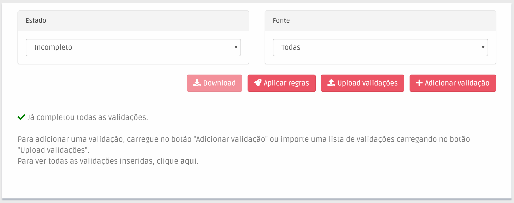

# Adição manual

Na [página de validações](./), pode adicionar manualmente uma validação através do botão “+ Adicionar validação”, que lhe dá acesso a uma janela para o fazer.

Nesta janela pode preencher informação relativa ao nome, data de nascimento e país da pessoa que pretende validar.  


### O que devo saber antes de introduzir informação?

#### Nome

* No mínimo, apenas são permitidos nomes de pessoas com pelo menos 2 nomes e data de nascimento. Caso não tenha informação relativa à data de nascimento, terá de introduzir, no mínimo, 3 nomes.  Estes requisitos mínimos existem de forma a garantir que o sistema tem a capacidade de sugerir resultados relevantes quando pretenda analisar se a pessoa é identificável. 
* Todos os [caracteres latinos](https://en.wikipedia.org/wiki/ISO/IEC_8859-1), sua acentuação e capitalização **são** suportados, não alterando os resultados apresentados no processo de análise. Pode, por isso, introduzir o nome no formato que lhe seja mais conveniente.  Exemplificando:  "Inês Marçal Romão" será equivalente a introduzir "ines marcal romao".
* Para além dos acima mencionados,  apenas são aceites espaços \(" "\), hífenes \("-"\) ou apóstrofes \(" ' "\).   
* As [partículas](https://www.irn.mj.pt/IRN/sections/irn/a_registral/registo-civil/docs-do-civil/dar-o-nome/) existentes no nome \(como "de", "da", "e", etc.\) não alteram os resultados apresentados no processo de análise.  Exemplificando:  "Rui Miguel do Rio" será equivalente a introduzir "Rui Miguel Rio".
* Abreviaturas são suportadas. No entanto, estas não poderão ser procedidas com um ponto. Exemplificando:  "Rui M Rio" poderá ter como resultado o nome "Rui Miguel Rio".
* Todos os pontos anteriores foram implementados de forma a tornar o processo o mais robusto possível. No entanto, recomendamos que tente introduzir nomes o mais próximo do original quanto possível.

#### País

* Este campo é analisado de forma independente, sendo apenas verificado se o país introduzido se encontra [sancionado](../../glossario/glossario-aplicacao.md#pais-sancionado). Deste modo, este campo poderá ter significados distintos como: origem dos fundos do cliente, local de residência fiscal ou qualquer outro que considere relevante. Nota: caso o país associado a uma [validação](../../glossario/glossario-aplicacao.md#validacao) se encontre [sancionado](../../glossario/glossario-aplicacao.md#pais-sancionado), a [validação](../../glossario/glossario-aplicacao.md#validacao) irá herdar esta [classificação](../../glossario/glossario-aplicacao.md#classificacao), independentemente de corresponder a uma [pessoa identificável](../../glossario/glossario-aplicacao.md#pessoa-identificavel). Uma [validação](../../glossario/glossario-aplicacao.md#validacao) pode ter múltiplas classificações distintas. 


Após preenchimento da informação, existem duas opções, que são acedidas clicando nos botões com o mesmo nome:

#### Adicionar e analisar

Adiciona a [validação](../../glossario/glossario-aplicacao.md#sancionado) ao sistema e abre imediatamente a sua janela de análise manual.

#### Adicionar 

Adiciona a [validação](../../glossario/glossario-aplicacao.md#validacao) ao sistema, mas mantém a janela de adição manual aberta para que possa adicionar vários nomes seguidos.

