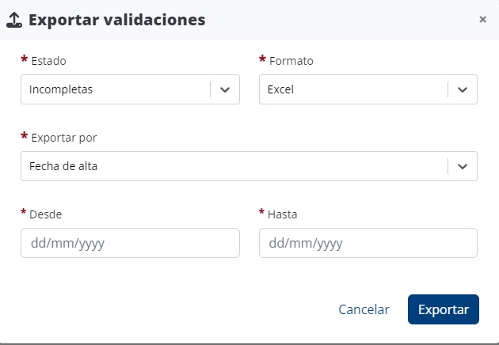

# Exportación de la validación

## Exportación de varias validaciones&#x20;

En la [página de validaciones](./), puede exportar las validaciones a diferentes formatos a través del botón "Exportar", que le da acceso a una ventana de exportación.

<figure><figcaption>
Ventana de descarga de validaciones
</figcaption></figure>


### Sugerencias

* Puede exportar las validaciones incompletas, tras [aplicación de reglas](aplicacao-de-regras.md) y un primer intento de[ análisis manual,](analise-manual.md) para conocer los casos en los que necesita obtener más información.
* Puede exportar las validaciones _completas - identificadas_ para utilizarlas en los procesos internos de aceptación del cliente.


### Estructura del archivo exportado

El archivo exportado tiene las siguientes columnas:

* **Type**: Tipo de validación. Pueder tener los valores "Individual" u "Organization", dependiendo de si la validación se refiere a una persona o a una organización.
* **Id**: identificador único para la [validación](../../glossario/glossario-aplicacao.md#validacao).&#x20;
* **Id\_Custom**: Identificador personalizable introducido por ele usuario.
* **Vatin**: Número de Identificación Fiscal asociado a la validación. &#x20;
* **Source**: Origen de la validación. Puede tener los valores “Manual” o “Automatic”, dependiendo si la [validación](../../glossario/glossario-aplicacao.md#validacao) fue agregada [manualmente](analise-manual.md) o a través de la [importación de validaciones](upload-de-validacoes.md), respetivamente.&#x20;
* **Name**: Nombre introducido por el usuario durante la [validación](../../glossario/glossario-aplicacao.md#validacao).&#x20;
* **Birth\_Date**: Fecha de nacimiento introducida por el usuario en la [validación](../../glossario/glossario-aplicacao.md#validacao): formato dd-mm-yyyy. Esta columna solo se usa para almacenar información de validaciones de personas.
* **Country**: País introducido por el usuario durante la [validación](../../glossario/glossario-aplicacao.md#validacao).&#x20;
* **Country\_Address**: País de dirección asociado a la validación. Esta columna solo se usa para almacenar información de validaciones de personas.
* **Country\_Classifications**: Listas de los países sancionados, separados por ';' cuando hay varios. Formato: “Sanctioned X” donde X es la entidad que identifica al país como sancionado.&#x20;
* **Id\_IPerson**: Identificador único relativo a la persona identificada. Esta columna solo se usa para almacenar información de validaciones de personas.
* **entity\_classifications**: Tipos de [clasificación](../../glossario/glossario-aplicacao.md#classificacao) de la persona u organización identificable, separados por “;” en caso de varios.
  * En el caso de una persona, los tipos de clasificación pueden ser: “PEP”, “Family Member”, “Associate” o “Sanctioned X” donde X es la lista que identifica a la persona como sancionada.&#x20;
  * En el caso de una organización, el tipo de clasificación puede ser “Sanctioned X” donde X es la lista que identifica a la persona como sancionada.
* **IPerson\_Name**: Nombre de la persona identificada. Esta columna solo se usa para almacenar información de validaciones de personas.
* **IPerson\_Birth\_Date**: Fecha de nacimiento de la persona identificada. Esta columna solo se usa para almacenar información de validaciones de personas.
* **IPerson\_Occupations**: Ocupaciones asociadas a la person identificada, separadas por ";" en caso de que sean varios. Esta columna solo se usa para almacenar información de validaciones de personas.
* **IPerson\_Family\_Relations**: Relaciones familiares entre la persona identificada y otras personas identificadas, separadas por ";" en caso de que sean varios. Esta columna solo se usa para almacenar información de validaciones de personas.
* **IPerson\_Associate\_Relations**: Relaciones en las que la persona identificada aparece como "Asociado" de otras personas identificadas, separadas por ";" en caso de que sean varios. Esta columna solo se usa para almacenar información de validaciones de personas.
* **Id\_IOrganization**: Identificador único relativo a la organización identificada. Esta columna solo se usa para almacenar información de validaciones de organizaciones.
* **IOrganization\_Name**: Nombre de la persona jurídica identificada. Esta columna solo se usa para almacenar información de validaciones de organizaciones.
* **Added\_At**: Fecha en que se agregó la [validación](../../glossario/glossario-aplicacao.md#validacao): formato dd-mm-yyyy HH:MM:SS.&#x20;
* **Added\_By**: Usuario que ha agregado la [validación](../../glossario/glossario-aplicacao.md#validacao): formato Nombre (correo electrónico).
* **Determined\_At**: Fecha en la que se determinó la [validación](../../glossario/glossario-aplicacao.md#validacao): formato dd-mm-yyyy HH:MM:SS.
* **Determined\_By**: Usuario que realizó la [validación](../../glossario/glossario-aplicacao.md#validacao): formato Nombre (correo electrónico).

